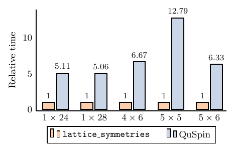

# lattice_symmetries 


**WARNING** This is work-in-progress

A package to simplify working with symmetry-adapted quantum many-body bases
(think spin systems). This package is written with two main applications in
mind:

  * Exact diagonalization;
  * Experiments with neural quantum states and symmetries.

`lattice_symmetries` provides a relatively low-level and high-performance
interface to working with symmetries and Hilbert space bases and operators. If
all you want to do it to diagonalize a spin Hamiltonian, have a loop at
[`SpinED`](...) application which uses `lattice_symmetries` under the hood and
provides a high-level and user-friendly interface to exact diagonalization.

## Contents

* [Citing](#citing)
* [Installation](#installation)
    * [Installing from Conda](#installing-from-conda)
    * [Building from source](#building-from-source)
* [Example](#example)
* [Performance](#performance)
* [Reference](#reference)
    * [C interface](#c-interface)
    * [Python interface](#python-interface)
* [Reading the source code](#reading-the-source-code)
* [Other software](#other-software)


## Citing

If you are using this package in your research, please, consider citing the
following paper (**WIP**):
```
@unpublished{citekey,
  author = "",
  title  = "",
  note   = "",
  month  = "",
  year   = "",
  annote = "".
}
```
Also, the paper introduces all the basic concepts like symmetry-adapted basis,
spin configuration etc. If you are not yet familiar with the terminology it
is advised to have a look at the paper first before reading the reference
documentation or trying to use the code.


## Installation

### Installing from Conda

If you are mainly going to use the Python interface to the library, using
[Conda](https://docs.conda.io/en/latest/) is the suggested way of installing the package.

```{.sh}
conda install -c twesterhout lattice-symmetries
```

Since Python interface is written entirely in Python using `ctypes` module, C code is not linked
against Python or any other libraries like `numpy`. The above command should thus in principle
work in any environment with **Python version 3.7 or above**.

The package contains both C and Python interfaces, so even if you do not need the Python
interface, using `conda` is the simplest way to get started.


### Compiling from source

If you are going to contribute to the project or just want to have more control
over the installation, it is possible to compile `lattice_symmetries` from
source. There are almost no external dependencies so the process is quite
simple. You will need the following:

  * C & C++ compiler (with C++17 support);
  * GNU Make or Ninja;
  * CMake (**3.15+**);
  * Git

We also provide a [Conda environment
file](https://github.com/twesterhout/lattice-symmetries/blob/master/conda-devel.yml)
which contains the required dependencies (except Git).

First step is to clone the repository:

```{.sh}
git clone https://github.com/twesterhout/lattice-symmetries.git
cd lattice-symmetries
```

Create a directory where build artifacts will be stored (we do not support in-source
builds):

```{.sh}
mkdir build
cd build
```

Run the configure step which will determine the compilers to use, download
dependencies etc.

```{.sh}
cmake -DCMAKE_BUILD_TYPE=Release -DCMAKE_INSTALL_PREFIX=</where/to/install> ..
```

The following CMake parameters affect the build:

  * `BUILD_SHARED_LIBS`: when `ON` shared version of the library will be built, otherwise --
    static. Note that static library does not include the dependencies. It is thus suggested to
    use the shared version unless you know what you are doing.
  * `CMAKE_INSTALL_PREFIX`: where to install the library.
  * `CMAKE_BUILD_TYPE`: typically `Release` for optimized builds and `Debug` for development and
    testing.
  * `LatticeSymmetries_ENABLE_UNIT_TESTING`: when `ON` unit tests will be compiled (default:
    `ON`).
  * `LatticeSymmetries_ENABLE_CLANG_TIDY`: when `ON`, `clang-tidy` will be used for static
    analysis.


Build the library:

```{.sh}
cmake --build .
```

And finally install it:

```sh
cmake --build . --target install
```


## Example

Have a look into [example/getting_started](https://github.com/twesterhout/lattice-symmetries/tree/master/example/getting_started). It provides very simple examples how to use `lattice_symmetries` from both Python and C.


## Performance





## Reference

### C interface

1. Add the following include your source file
```c
#include <lattice_symmetries/lattice_symmetries.h>
```

2. Link against `liblattice_symmetries.so` (or `.dylib` if you're on OS X, or
   `.a` if you're using the static version).


#### Symmetries

Opaque struct representing a symmetry operator:
```c
typedef struct ls_symmetry ls_symmetry;
```

Symmetries are created and destructed using the following two functions:
```c
ls_error_code ls_create_symmetry(ls_symmetry** ptr, unsigned length, unsigned const permutation[],
                                 bool flip, unsigned sector);
void ls_destroy_symmetry(ls_symmetry* symmetry);
```
`ls_create_symmetry` accepts a `permutation` of indices `{0, 1, ..., length-1}`,
a flag which indicates whether to apply global spin inversion, and `sector`
specifying the eigenvalue. Upon successful completion (indicated by returning
`LS_SUCCESS`), `*ptr` is set to point to the newly allocated `ls_symmetry`
object.

*Periodicity* of the symmetry operator `T` is the smallest positive integer `N`
such that <code>T<sup>N</sup> = 1</code>. It then follows that eigenvalues of
`T` are roots of unity: `2πik/N` for `k ∈ {0, ..., N-1}`. `sector` argument
specifies the value of `k`.

Various properties of the symmetry operator can be accessed using the getter
functions:
```c
unsigned ls_get_sector(ls_symmetry const* symmetry);
bool ls_get_flip(ls_symmetry const* symmetry);
double ls_get_phase(ls_symmetry const* symmetry);
void ls_get_eigenvalue(ls_symmetry const* symmetry, void* out); // _Complex double*
unsigned ls_get_periodicity(ls_symmetry const* symmetry);
unsigned ls_symmetry_get_number_spins(ls_symmetry const* symmetry);
```
`ls_get_eigenvalue` function stores the eigenvalue in `out` parameter using
`_Complex double` datatype (same as `std::complex<double>` in C++).

Finally, symmetry operators can also be applied to spin configurations:
```c
void ls_apply_symmetry(ls_symmetry const* symmetry, uint64_t bits[]);
```
**TODO:** document length of `bits`.


#### Symmetry groups

Opaque struct representing a symmetry group:
```c
typedef struct ls_group ls_group;
```

Symmetry groups are constructed and destructed using the following functions:
```c
ls_error_code ls_create_group(ls_group** ptr, unsigned size, ls_symmetry const* generators[]);
void ls_destroy_group(ls_group* group);
```
`ls_create_group` receives an array of `size` symmetry generators and tries to
build a group from them. If symmetries are incommensurable an error will be
returned. Note that `ls_create_group` **does not take ownership** of `generators`.

There is currently just one getter which allows to obtain the size of the group:
```c
unsigned ls_get_group_size(ls_group const* group);
```


#### Spin basis

Opaque struct representing a spin basis:
```c
typedef struct ls_spin_basis ls_spin_basis;
```

Bases are created and destructed using the following functions:
```c
ls_error_code ls_create_spin_basis(ls_spin_basis** ptr, ls_group const* group,
                                   unsigned number_spins, int hamming_weight);
ls_spin_basis* ls_copy_spin_basis(ls_spin_basis const* basis);
void ls_destroy_spin_basis(ls_spin_basis* basis);
```
`ls_create_spin_basis` receives a symmetry group, the number of spins in the
system, and Hamming weight. Symmetry group may be empty (i.e. if
`ls_create_group` was called with no symmetries), but must not be `NULL`. If one
does not wish to restrict the space to a particular Hamming weight, `-1` can be
used for `hamming_weight`. Upon successful completion of the function `*ptr` is
set to point to the newly constructed spin basis. The basis should later on be
destroyed using `ls_destroy_spin_basis`, otherwise a memory leak will occur.

`ls_copy_spin_basis` allows one to create a shallow copy of the basis. A copy
obtained from `ls_copy_spin_basis` must also be destroyed using
`ls_destroy_spin_basis`. Internally, reference counting is used, so copying a
basis even for a large system is a cheap operation.

The are a few functions to query basis properties:
```c
unsigned ls_get_number_spins(ls_spin_basis const* basis);
unsigned ls_get_number_bits(ls_spin_basis const* basis);
int ls_get_hamming_weight(ls_spin_basis const* basis);
bool ls_has_symmetries(ls_spin_basis const* basis);
```
`ls_get_number_spins` returns the number of spins in the system.
`ls_get_number_bits` returns the number of bits used to represent spin
configurations. `ls_get_hamming_weight` returns the Hamming weight, `-1` is
returned if Hilbert space is not restricted to a particular Hamming weight.
`ls_has_symmetries` returns whether lattice symmetries were used in the
construction of the basis.

```c
void ls_get_state_info(ls_spin_basis* basis, uint64_t const bits[8], uint64_t representative[8],
                       void* character, double* norm);
```
**TODO:** description.

There are also a few functions which are available only for small systems after
a list of representatives has been built:
```c
ls_error_code ls_build(ls_spin_basis* basis);
ls_error_code ls_get_number_states(ls_spin_basis const* basis, uint64_t* out);
ls_error_code ls_get_index(ls_spin_basis const* basis, uint64_t const bits[1], uint64_t* index);
```
`ls_build` function builds the internal cache. Is is a quite expensive operation.

```c
ls_error_code ls_get_states(ls_states** ptr, ls_spin_basis const* basis);
void          ls_destroy_states(ls_states* states);
uint64_t const* ls_states_get_data(ls_states const* states);
uint64_t ls_states_get_size(ls_states const* states);
```


#### Interactions


#### Operators


#### Error handling


### Python interface


## Other software

[QuSpin](...) is a very general Python package for working with many-body
systems using exact-diagonalization-like methods. I am a big fan! However, it is
very tightly coupled to Python and could not be easily incorporated into
variational Monte Carlo code I was working on. This was my main reason for
partially reimplementing QuSpin's functionality. Hence, this package provides a
portable C interface with minimal dependencies.

It turns out, however, that this package is also considerably faster than QuSpin
and can thus handle larger systems. For systems larger than 32 spins, storing
the Hamiltonian as a matrix (even sparse) is impractical. However, computing
matrix elements on the fly requires that symmetry applications are very
efficient, and the implementation in QuSpin is not quite there yet.


## Reading the source code

The code can be roughly divided into a few layers. At the very bottom we have
error handling (`error_handling.*` files) and utilities (`bits512.hpp`,
`intrusive_ptr.hpp` files). Next, we have the permutation-to-Benes-network
compiler (`permutation.*` files). Intermediate representation if these networks
are then converted into more compact form optimized for forward propagation
(`network.*` files define the representation and `kernel.*` files implement the
 forward propagation). Using Benes networks we build symmetries (`symmetry.*`).
They keep track of the characters of the symmetry group, allow to find
representative vectors, etc. Given a bunch of symmetry operators, we construct
the symmetry group (`group.*` files). Finally, this symmetry group is used to
construct a Hilbert space basis (`basis.*` files). For small systems, one can
explicitly construct a list of all representative vectors of the basis. We call
it "cache" (`cache.*` files). It allows one to determine the Hilbert space
dimension, assigns indices to representative vectors etc.

Having a Hilbert space basis is typically not enough. We need to define a
Hamiltonian. All operators in `lattice_symmetries` are assumed to be Hermitian
and are defined as sums of "interaction" terms (`operator.*` files). These are
just small operators defined on 1-, 2-, 3-, or 4-spin subsystems. Operators can
then be applied to explicit vectors (e.g. for exact diagonalization) of in a CPS
(continuation-passing-style) for more general applications (e.g. neural quantum
states).
