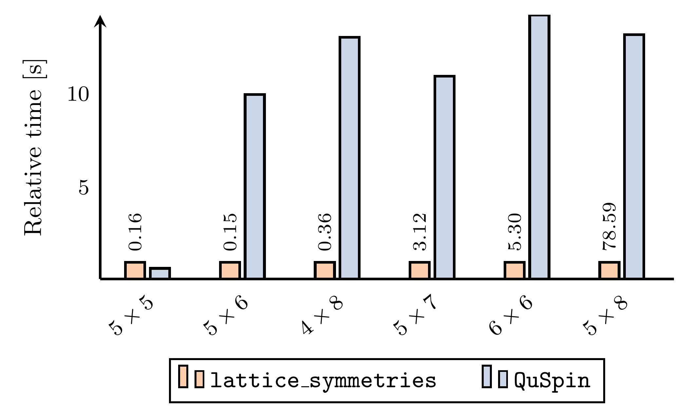
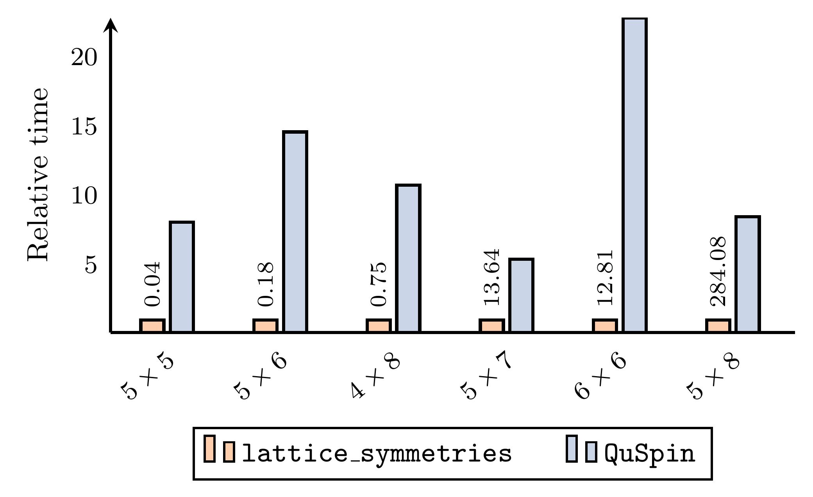

# lattice_symmetries 
[](https://opensource.org/licenses/BSD-3-Clause)[](https://doi.org/10.21105/joss.03537)

A package to simplify working with symmetry-adapted quantum many-body bases
(think spin systems). It is written with two main applications in mind:

* [Exact diagonalization](https://en.wikipedia.org/wiki/Exact_diagonalization);
* Experiments with [neural quantum
  states](https://en.wikipedia.org/wiki/Neural_network_quantum_states) and
  symmetries.

`lattice_symmetries` provides a relatively low-level (and high-performance)
interface to working with symmetries and Hilbert space bases and operators. If
all you want to do it to diagonalize a spin Hamiltonian, have a look at
[`SpinED`](https://github.com/twesterhout/spin-ed) application which uses
`lattice_symmetries` under the hood and provides high-level and user-friendly
interface to exact diagonalization.


## :pray: Help wanted!

There are a few improvements to this package which could benefit a lot of
people, but I do not really have time to do them all myself...

1) Distributed matrix-vector products. It would be nice to be able to run
`SpinED` on, say, 4 nodes to have a bit more memory. *(Good project for a Master
thesis)*.
2) Fermion basis which handles symmetries properly. This would open up a
possibility to use `SpinED` (or `lattice_symmetries` directly) as a
[DMFT](https://en.wikipedia.org/wiki/Dynamical_mean-field_theory) solver. This
is a matter of plugging `-1`s in the right places, but should be done carefully!
*(Good project for a Master thesis)*.
3) Sublattice-coding techniques. This *could* potentially speed-up
`ls_get_state_info` function (see [C API documentation](#spin-basis) for more
info). Whether it *will* actually help is not clear at all since batching of
symmetries already does a great performance-wise... *(Good project for a
Bachelor thesis)*

If you are interested in working on one of these ideas, please, do not hesitate
to contact me. I would be happy to discuss it further and guide you through it.


## Contents

* [Citing](#scroll-citing)
* [Installing](#rocket-installing)
    * [Conda](#conda)
    * [Compiling from source](#compiling-from-source)
* [Example](#surfing_woman-example)
* [Performance](#bicyclist-performance)
* [Key concepts](#key-concepts)
* [C API](#c-api)
    * [Error handling](#error-handling)
    * [Spin configuration](#spin-configuration)
    * [Symmetry](#symmetry)
    * [Symmetry group](#symmetry-group)
    * [Spin basis](#spin-basis)
    * [Interaction](#interaction)
    * [Operator](#operator)
* [Python API](#python-api)
* [Other software](#other-software)
* [Acknowledgements](#acknowledgements)


## :scroll: Citing

If you are using this package in your research, please, consider citing the
following paper:
```
@misc{westerhout2021latticesymmetries,
  title={lattice-symmetries: A package for working with quantum many-body bases},
  author={Tom Westerhout},
  year={2021},
  eprint={2104.04011},
  archivePrefix={arXiv},
  primaryClass={cond-mat.str-el}
}
```


## :rocket: Installing

System requirements:

  * Linux or OS X operating system (although OS X support is not well tested);
  * x86-64 processor with
  [nehalem](https://en.wikipedia.org/wiki/Nehalem_(microarchitecture)) (released
  in 2008) or newer microarchitecture.

:information_source: **Note:** even though we list Nehalem as the oldest
supported microarchitecture, the library is not Intel only. The code will work
on AMD processors just fine (and just as fast).

### Conda

If you are mainly going to use the Python interface, using
[Conda](https://docs.conda.io/en/latest/) is the suggested way of installing the
package.

```sh
conda install -c twesterhout lattice-symmetries
```

:information_source: **Note:** Conda package installs both C and Python
interfaces, so even if you do not need the Python interface, using `conda` is
the simplest way to get started.


### Compiling from source

If you are going to contribute to the project or just want to have more control
over the installation, it is possible to compile `lattice_symmetries` from
source. There are almost no external dependencies so the process is quite
simple. You will need the following:

  * C & C++ compiler (with C++17 support);
  * GNU Make or Ninja;
  * CMake (**3.15+**);
  * Git

We also provide a Conda environment files for [Linux](https://github.com/twesterhout/lattice-symmetries/blob/master/conda-devel-linux.yml) and [macOS](https://github.com/twesterhout/lattice-symmetries/blob/master/conda-devel-osx.yml)
which contains the required dependencies (except Git).

First step is to clone the repository:

```sh
git clone https://github.com/twesterhout/lattice-symmetries.git
cd lattice-symmetries
git submodule update --init --recursive
```

Create a directory where build artifacts will be stored:

```sh
mkdir build
cd build
```

Run the configure step which will determine the compilers to use, download
dependencies etc.

```sh
cmake -GNinja -DBUILD_SHARED_LIBS=ON -DCMAKE_BUILD_TYPE=Release ..
```

The following CMake parameters affect the build:

  * `BUILD_SHARED_LIBS`: when `ON` shared version of the library will be built,
  otherwise -- static. Note that static library cannot be loaded from Python. It
  is suggested to use the shared version unless you know what you are doing.
  * `CMAKE_INSTALL_PREFIX`: where to install the library.
  * `CMAKE_BUILD_TYPE`: typically `Release` for optimized builds and `Debug` for
  development and testing.
  * `LatticeSymmetries_ENABLE_UNIT_TESTING`: when `ON` unit tests will be
  compiled (default: `ON`).
  * `LatticeSymmetries_ENABLE_CLANG_TIDY`: when `ON`, `clang-tidy` will be used
  for static analysis. Note that this slows down the compilation quite a bit.
  * Other standard CMake flags such as `CMAKE_CXX_COMPILER`, `CMAKE_CXX_FLAGS`,
  etc.


Build the library:

```sh
cmake --build .
```

And finally install it:

```sh
cmake --build . --target install
```

Now you can install Python wrappers using `pip`:

```sh
cd .. # leave build/ directory
python3 -m pip install -e python/
```

Note that Python code uses `pkg-config` to determine the location of
`liblattice_symmetries.so` (or `.dylib`). Make sure you either set
`PKG_CONFIG_PATH` appropriately or install into a location known to
`pkg-config`.


## :surfing_woman: Example

[`example/getting_started`](https://github.com/twesterhout/lattice-symmetries/tree/master/example/getting_started)
folder contains `main.py` and `main.c` files which illustrate very basic usage
of the package from both Python and C. The code contains explanatory comments.

To run the example from Python simply type:

```console
$ cd example/getting_started
$ python3 main.py
Symmetry group contains 20 elements
Hilbert space dimension is 13
Ground state energy is -18.0617854180
```

To run the example from C we first need to compile it:

```console
$ # (Optionally) tell pkg-config where lattice_symmetries library was installed.
$ # If you installed the package using Conda, it's already taken care of for you.
$ #
$ # export PKG_CONFIG_PATH=/path/to/lib/pkgconfig:$PKG_CONFIG_PATH
$ cc `pkg-config --cflags lattice_symmetries` -o main main.c `pkg-config --libs lattice_symmetries`
```

Now we can run it as well:

```console
$ # (Optionally) tell ld where lattice_symmetries library was installed:
$ # If you installed the package using Conda, it's already taken care of for you.
$ #
$ # export LD_LIBRARY_PATH=/path/to/lib:$LD_LIBRARY_PATH
$ ./main
Symmetry group contains 20 elements
Hilbert space dimension is 13
Ground state energy is -18.0617854180
```


## :bicyclist: Performance

The only package (that I'm aware of) with similar functionality to
`lattice_symmetries` is [`QuSpin`](https://github.com/weinbe58/QuSpin). Hence,
we compare the performance of `lattice_symmetries` to `QuSpin`.

:information_source: **Disclaimer:** all benchmarks were run on 2-socket AMD
EPYC 7502 with 64 cores (32 per socket). You may get different results depending
on which processor you use.

Scripts for running the benchmarks and plotting are available in
[`benchmark/`](./benchmark) folder.

### Constructing basis representatives

Let us start with an operation which focuses solely on groups and symmetries.
When working in symmetry-adapted bases, one typically works with *orbits* rather
than spin configurations. For each orbit we store a special element (usually
the one which has the smallest integer representation) and call it the orbit's
*representative*. To determine the Hilbert space dimension, construct a
Hamiltonian, and do exact diagonalization one first needs to find all such
representatives. This is a computationally-heavy operation since one typically
has to loop over either *2ᴺ* or *C(N, N/2)* spin configurations (even though the
dimension of the Hilbert space may be a 100 or even a 1000 times smaller).

In the following plot we compare how much time `lattice_symmetries` and `QuSpin`
libraries spend finding representatives for square lattices of various sizes. In
all cases we include as many symmetries as possible (U(1), translations, reflections,
where possible rotations, and where possible global spin inversion).



We clearly see that `lattice_symmetries` outperforms `QuSpin` for systems ≥30
spins. Results for smaller systems should be taken with a grain of salt, because
Python overhead starts to play an important role, and the comparison is not fair
anymore.

Note also that on top of being faster `lattice_symmetries` is also more memory
efficient (*disclaimer:* this is only the case for QuSpin with OpenMP support; in
serial mode QuSpin does not waste memory, but is at least another order of
magnitude slower). This is especially important for systems of ≥42 spins where
just storing a vector of representatives requires more than 20GB of RAM.

### Calculating matrix-vector products

Let us now consider the matrix-vector products which are the most important
operation for sparse linear algebra problems, and eigenvalue problems in
particular. We will consider the case when the matrix is defined implicitly,
without storing all matrix elements.

We again consider square lattices of various sizes. We will use simple
Heisenberg interaction between nearest neighbours as our matrix. In the
following plot we compare how much time `lattice_symmetries` and `QuSpin`
libraries spend computing a single matrix-vector product.



Depending on the system, speedups vary from 5 to 22 times, but in all cases
`lattice_symmetries` performs better.


## Key concepts

In this section we briefly review the construction and of symmetry-adapted bases
and operators. Since this topic is well known
[(Sandvik2010)](https://doi.org/10.1063/1.3518900), only the key concepts which
are necessary to understand high-level algorithms in `lattice_symmetries`, are
discussed here.

Suppose that we are dealing with a system of *N* spins numbered from *0* to *N−1*. It
is described by a Hamiltonian *H* which commutes with a collection of symmetry
generators *T<sub>k</sub>*. *T<sub>k</sub>*’s form a group *G*. If *G* admits an
irreducible one-dimensional representation *χ: G → ℂ*, we can restrict our
Hilbert space to the subspace of vectors which are eigenstates of symmetry
operators *g ∈ G* with the corresponding eigenvalues *χ(g)*. This is done by
introducing a smaller basis in terms of the original basis *{|σ⟩}*. We effectively
replace original elements *|σ⟩* with **orbits** *orbit(σ) = {g|σ⟩ | g∈G}*. For each orbit
we choose a **representative** vector as *|σ̃⟩ = min orbit(σ)* where ordering is
defined by integer representations of spin configurations. Putting it all
together, we define the symmetry-adapted basis: *|S⟩ = norm *
∑<sub><sub>g ∈ G</sub></sub> χ\*(g) g|σ̃⟩*.  Here, *norm* is chosen such that
⟨S|S⟩ = 1.


## C API

1) Add the following include your source file

   ~~~~c
   #include <lattice_symmetries/lattice_symmetries.h>
   ~~~~

2. Link against `liblattice_symmetries.so` (or `.dylib` if you're on OS X, or
   `.a` if you're using the static version). `pkg-config` can take care of it
   for you.


### Error handling

`lattice_symmetries` library uses status codes for reporting errors. `ls_error_code` specifies all
possible status codes which can be returned by library functions:

```c
typedef enum ls_error_code {
    LS_SUCCESS = 0,             ///< No error
    LS_OUT_OF_MEMORY,           ///< Memory allocation failed
    LS_INVALID_ARGUMENT,        ///< Argument to a function is invalid
    LS_INVALID_HAMMING_WEIGHT,  ///< Invalid Hamming weight
    LS_INVALID_SPIN_INVERSION,  ///< Invalid value for spin_inversion
    LS_INVALID_NUMBER_SPINS,    ///< Invalid number of spins
    LS_INVALID_PERMUTATION,     ///< Argument is not a valid permutation
    LS_INVALID_SECTOR,          ///< Sector exceeds the periodicity of the operator
    LS_INVALID_STATE,           ///< Invalid basis state
    LS_INVALID_DATATYPE,        ///< Invalid datatype
    LS_PERMUTATION_TOO_LONG,    ///< Such long permutations are not supported
    LS_INCOMPATIBLE_SYMMETRIES, ///< Symmetries are incompatible
    LS_NOT_A_REPRESENTATIVE,    ///< Spin configuration is not a representative
    LS_WRONG_BASIS_TYPE,        ///< Expected a basis of different type
    LS_CACHE_NOT_BUILT,         ///< List of representatives is not yet built
    LS_COULD_NOT_OPEN_FILE,     ///< Failed to open file
    LS_FILE_IO_FAILED,          ///< File input/output failed
    LS_CACHE_IS_CORRUPT,        ///< File does not contain a list of representatives
    LS_OPERATOR_IS_COMPLEX,     ///< Trying to apply complex operator to real vector
    LS_DIMENSION_MISMATCH,      ///< Operator dimension does not match vector length
    LS_SYSTEM_ERROR,            ///< Unknown error
} ls_error_code;
```

Names of the constants should explain errors pretty well, however for
higher-level wrappers it is useful to convert these status codes to
human-readable messages. `ls_error_to_string` function provides such
functionality:

```c
char const* ls_error_to_string(ls_error_code code);
```

:information_source: **Note:** Even though internally the library is written in C++17, exceptions are disabled
during compilation. I.e. we never throw exceptions, all errors are reported
using status codes. This makes it easy and safe to use the library inside OpenMP
loops.


### Spin configuration

Depending on the context (i.e. whether it is known if the system size is less
than 64) one of the following two types is used to represent spin
configurations:

```c
typedef uint64_t ls_bits64;

typedef struct ls_bits512 {
    ls_bits64 words[8];
} ls_bits512;
```

:bangbang: **Warning:** we do not support systems with more than 512 spins. This
is a design decision to limit the memory footprint of a single spin
configuration. If you really want to use `lattice_symmetries` for larger
systems, please, let us know by opening an
[issue](https://github.com/twesterhout/lattice-symmetries/issues).

Each spin is represented by a single bit. The order of spins is determined by
the underlying hardware [endianness](https://en.wikipedia.org/wiki/Endianness).
For example, you can use the following functions to get the value (`+1` or `-1`)
of the `n`th spin:

```c
int get_nth_spin_64(ls_bits64 const bits, unsigned const n)
{
    return 2 * (int)((bits >> n) & 1U) - 1;
}

int get_nth_spin_512(ls_bits512 const* bits, unsigned const n)
{
    return get_nth_spin_64(bits->words[n / 64U], n % 64U);
}
```

Ordering of spin configurations is defined by the following functions:
```c
bool is_less_than_64(ls_bits64 const a, ls_bits64 const b)
{
    return a < b;
}

bool is_less_than_512(ls_bits512 const* a, ls_bits512 const* b)
{
    for (int i = 0; i < 8; ++i) {
        if (is_less_than_64(a, b)) { return true; }
        if (is_less_than_64(b, a)) { return false; }
    }
    return false;
}
```


### Symmetry

Opaque struct representing a symmetry operator *T*:

```c
typedef struct ls_symmetry ls_symmetry;
```

* * *

Symmetries are constructed and destructed using the following two functions:

```c
ls_error_code ls_create_symmetry(ls_symmetry** ptr, unsigned length, unsigned const permutation[],
                                 unsigned sector);
void ls_destroy_symmetry(ls_symmetry* symmetry);
```

`ls_create_symmetry` accepts a `permutation` of indices *{0, 1, ..., `length`-1}*
and `sector` specifying the eigenvalue.

Periodicity of a permutation operator T is the smallest positive integer *N*
such that *T<sup>N</sup> = 𝟙*. It then follows that eigenvalues of *T* are roots
of unity: *exp(-2πⅈk/N)* for *k ∈ {0, ..., N-1}*. `sector` argument specifies the
value of *k*.

Upon successful completion of `ls_create_symmetry` (indicated by returning
`LS_SUCCESS`), `*ptr` is set to point to the newly allocated `ls_symmetry`
object. All pointers created using `ls_create_symmetry` must be destroyed using
`ls_destroy_symmetry` to avoid memory leaks.


**Example:** the following code snippet constructs lattice momentum symmetry
operator with eigenvalue *exp(-πⅈ/4)*:

```c
unsigned const permutation[8] = {1, 2, 3, 4, 5, 6, 7, 0};
ls_symmetry* symmetry;
ls_error_code status = ls_create_symmetry(&symmetry, 8, permutation, 1);
if (status != LS_SUCCESS) { /* handle error */ }
/* Do stuff with symmetry */
ls_destroy_symmetry(symmetry);
```


* * *

Various properties can be accessed using getter functions:

```c
unsigned ls_get_periodicity(ls_symmetry const* symmetry);
void ls_get_eigenvalue(ls_symmetry const* symmetry, _Complex double* out);
unsigned ls_get_sector(ls_symmetry const* symmetry);
double ls_get_phase(ls_symmetry const* symmetry);
unsigned ls_symmetry_get_number_spins(ls_symmetry const* symmetry);
```

`ls_get_periodicity` returns the periodicity *N* such that applying the symmetry
*N* times results in identity. `ls_get_eigenvalue` stores the eigenvalue
*exp(-2πⅈk/N)* in `out`. *k* is the sector which can be obtained with
`ls_get_sector`. `ls_get_phase` returns *k / N*. `ls_symmetry_get_number_spins`
returns the number of spins for which the symmetry was constructed (i.e.
`length` of the permutation which was passed to `ls_create_symmetry`)

* * *

Symmetry operators can also be applied to spin configurations:

```c
void ls_apply_symmetry(ls_symmetry const* symmetry, ls_bits512* bits);
```

`ls_apply_symmetry` will permute `bits` in-place according to the permutation
with which the symmetry was constructed.

**Example:** we apply the previously constructed momentum operator to a spin
configuration.

```c
/* Just as before... */
unsigned const permutation[8] = {1, 2, 3, 4, 5, 6, 7, 0};
ls_symmetry* symmetry;
ls_error_code status = ls_create_symmetry(&symmetry, 8, permutation, 1);
if (status != LS_SUCCESS) { /* handle error */ }
/* Applying symmetry to a spin configuration |01001101⟩ = 0b10110010 = 0xB2. We
   expect the result to be |10011010⟩ = 0b01011001 = 0x59
 */
ls_bits512 spin = {0xB2, 0, 0, 0, 0, 0, 0, 0};
ls_apply_symmetry(symmetry, &spin);
assert(spin.words[0] == 0x59);
ls_destroy_symmetry(symmetry);
```


### Symmetry group

Opaque struct representing a symmetry group *G*:

```c
typedef struct ls_group ls_group;
```

Groups are meant to be used mostly as intermediate data structured for
constructing the bases. We do not provide many functions for working with them.

* * *

Symmetry groups are constructed and destructed using the following functions:

```c
ls_error_code ls_create_group(ls_group** ptr, unsigned size, ls_symmetry const* generators[]);
void ls_destroy_group(ls_group* group);
```

`ls_create_group` receives an array of `size` symmetry generators
*T<sub>k</sub>* and tries to build a group from them. If symmetries are
incommensurable an error will be returned. Note that `ls_create_group` **does
not take ownership** of `generators`.

Upon successful completion of `ls_create_group` (indicated by returning
`LS_SUCCESS`), `*ptr` is set to point to the newly allocated `ls_group` object.
All pointers created using `ls_create_group` must be destroyed using
`ls_destroy_group` to avoid memory leaks.

* * *

Some information about a symmetry group can be obtained using the following
getter functions:

```c
unsigned ls_get_group_size(ls_group const* group);
ls_symmetry const* ls_group_get_symmetries(ls_group const* group);
int ls_group_get_number_spins(ls_group const* group);
```

`ls_get_group_size` returns the number of elements in the group.
`ls_group_get_symmetries` returns a pointer to an array of symmetries. This
array is internal and owned by `ls_group`. Do not try to `free` it and make
sure **that `ls_group` stays alive as long as you are using this pointer**.
`ls_group_get_number_spins` returns the number of spins in the system. If it
cannot be determined (because the group is empty), `-1` is returned.


### Spin basis

Opaque struct representing a spin basis:

```c
typedef struct ls_spin_basis ls_spin_basis;
```

* * *

Bases are created and destructed using the following functions:

```c
ls_error_code ls_create_spin_basis(ls_spin_basis** ptr, ls_group const* group,
                                   unsigned number_spins, int hamming_weight,
                                   int spin_inversion);
ls_spin_basis* ls_copy_spin_basis(ls_spin_basis const* basis);
void ls_destroy_spin_basis(ls_spin_basis* basis);
```

`ls_create_spin_basis` creates a basis given a symmetry group. Symmetry group
may be empty (i.e. if `ls_create_group` was called with no symmetries), but must
not be `NULL`. `number_spins` must be a positive integer indicating the number
of spins in the system. Hamming weight may be either a non-negative integer
specifying the Hamming weight to which to restrict the Hilbert space, or `-1` to
indicate that U(1) symmetry should not be used. `spin_inversion` may be `1` to
indicate that the system is symmetric upon global spin inversion, `-1` to
indicate that the system is anti-symmetric, or `0` to indicate that spin
inversion symmetry should not be used. Upon successful completion of the
function `*ptr` is set to point to the newly constructed spin basis. The basis
should later on be destroyed using `ls_destroy_spin_basis` to avoid memory
leaks.

`ls_copy_spin_basis` allows one to create a shallow copy of the basis. A copy
obtained from `ls_copy_spin_basis` must also be destroyed using
`ls_destroy_spin_basis`. Internally, reference counting is used, so copying a
basis (even for a large system) is a cheap operation.

* * *

The are a few functions to query basis properties:

```c
unsigned ls_get_number_spins(ls_spin_basis const* basis);
unsigned ls_get_number_bits(ls_spin_basis const* basis);
int ls_get_hamming_weight(ls_spin_basis const* basis);
bool ls_has_symmetries(ls_spin_basis const* basis);
```

`ls_get_number_spins` returns the number of spins in the system.
`ls_get_number_bits` returns the number of bits used to represent spin
configurations. `ls_get_hamming_weight` returns the Hamming weight, `-1` is
returned if Hilbert space is not restricted to a particular Hamming weight.
`ls_has_symmetries` returns whether lattice symmetries were used in the
construction of the basis. Note that only permutations and spin inversion count
as lattice symmetries here: `ls_has_symmetries` will return `false` if only U(1)
symmetry is enforced.

* * *

```c
void ls_get_state_info(ls_spin_basis const* basis, ls_bits512 const* bits,
                       ls_bits512* representative, _Complex double* character,
                       double* norm);
```

This is probably the most interesting function of `ls_spin_basis`.

Given a spin configuration *|σ⟩* it determines its representative *|σ̃⟩*,
character *χ(g)* of the group element *g* which transforms *|σ̃⟩* into *|σ⟩*, and
the normalization factor of the corresponding basis element *|S⟩*.

* * *

There are a few functions which are only available for small systems after
a list of representatives has been built:

```c
ls_error_code ls_get_number_states(ls_spin_basis const* basis, uint64_t* out);
ls_error_code ls_get_index(ls_spin_basis const* basis, uint64_t representative, uint64_t* index);
```

`ls_get_number_states` returns the dimension of the Hilbert space, i.e. the
total number of representatives. `ls_get_index` allows to find the index of a
representative.

Access to the list of all representatives is provided via the following opaque
type:

```c
typedef struct ls_states ls_states;

ls_error_code ls_get_states(ls_states** ptr, ls_spin_basis const* basis);
void ls_destroy_states(ls_states* states);
```

Similarly to other `ls_create_*` functions, `ls_get_states` sets `*ptr` to point
to the newly allocated `ls_states` object. This object must later on be
destructed using `ls_destroy_states` to avoid memory leaks. Internally,
`ls_states` is just a contiguous vector of `ls_bits64`. The following functions
give provide access to it:

```c
ls_bits64 const* ls_states_get_data(ls_states const* states);
uint64_t ls_states_get_size(ls_states const* states);
```

* * *

There are two functions for building internal cache of the basis (which also
contains the list of representatives):

```c
ls_error_code ls_build(ls_spin_basis* basis);
ls_error_code ls_build_unsafe(ls_spin_basis* basis, uint64_t size,
                              ls_bits64 const representatives[]);
```

These are the only functions which mutate the basis. **They are not thread
safe!** `ls_build` function builds the internal cache. It is a quite expensive
operation for large system (i.e. order of minutes on a decent server).
`ls_build_unsafe` unsafe allows one to speed up the build process considerably
by providing a list of representatives. No checks for validity of
`representatives` are performed. Use at your own risk!


### Interaction

Operators in `lattice_symmetries` are implemented via sums of 1-, 2-, 3-, and
4-point interaction terms. Such interaction terms are represented by the
following opaque struct:

```c
typedef struct ls_interaction ls_interaction;
```

* * *

Interactions are constructed and destructed using the following functions:

```c
ls_error_code ls_create_interaction1(ls_interaction** ptr, _Complex double const* matrix_2x2,
                                     unsigned number_nodes, uint16_t const* nodes);
ls_error_code ls_create_interaction2(ls_interaction** ptr, _Complex double const* matrix_4x4,
                                     unsigned number_edges, uint16_t const (*edges)[2]);
ls_error_code ls_create_interaction3(ls_interaction** ptr, _Complex double const* matrix_8x8,
                                     unsigned number_triangles, uint16_t const (*triangles)[3]);
ls_error_code ls_create_interaction4(ls_interaction** ptr, _Complex double const* matrix_16x16,
                                     unsigned number_plaquettes, uint16_t const (*plaquettes)[4]);
void ls_destroy_interaction(ls_interaction* interaction);
```

`ls_create_interactionN` creates an *N*-point interaction term given the
interaction matrix between *N* spins and a list of sites on which to act. Upon
successful completion of the function `*ptr` is set to point to the newly
constructed interaction. The basis should later on be destroyed using
`ls_destroy_interaction` to avoid memory leaks.

* * *

Interactions are meant to be used mostly as intermediate data structured for
constructing operators. We do not provide many functions for working with them.

```c
bool ls_interaction_is_real(ls_interaction const* interaction);
```

`ls_interaction_is_real` returns whether the interaction matrix is purely real.


### Operator

Opaque struct representing a Hermitian operator *O*:

```c
typedef struct ls_operator ls_operator;
```

Operators are constructed and destructed using the following functions:

```c
ls_error_code ls_create_operator(ls_operator** ptr, ls_spin_basis const* basis,
                                 unsigned number_terms, ls_interaction const* const terms[]);
void ls_destroy_operator(ls_operator* op);
```

`ls_create_operator` creates a new Hermitian operator given a basis and a list
`number_terms` interaction terms `terms`. Upon successful completion of the
function `*ptr` is set to point to the newly constructed operator. The basis
should later on be destroyed using `ls_destroy_operator` to avoid memory leaks.

* * *

Operators can be applied to individual basis elements:

```c
typedef ls_error_code (*ls_callback)(ls_bits512 const* bits, _Complex double const* coeff, void* cxt);

ls_error_code ls_operator_apply(ls_operator const* op, ls_bits512 const* bits, ls_callback func,
                                void* cxt);
```

`ls_operator_apply` applies operator `op` to a basis element `bits`. `func`
callback is called for every matrix element. `cxt` is used-defined additional
information passed to `func`.

* * *

Operators can also be applied to wavefunctions:

```c
typedef enum {
    LS_FLOAT32,    // 32-bit floating point number (float)
    LS_FLOAT64,    // 64-bit floating point number (double)
    LS_COMPLEX64,  // 64-bit complex number (_Complex float)
    LS_COMPLEX128, // 128-bit complex number (_Complex double)
} ls_datatype;

ls_error_code ls_operator_matmat(ls_operator const* op, ls_datatype dtype, uint64_t size,
                                 uint64_t block_size, void const* x, uint64_t x_stride, void* y,
                                 uint64_t y_stride);

ls_error_code ls_operator_expectation(ls_operator const* op, ls_datatype dtype, uint64_t size,
                                      uint64_t block_size, void const* x, uint64_t x_stride,
                                      void* out);
```


## Python API

Python API closely follows the C API except that class names start with capitals
(i.e. `ls_spin_basis` becomes `lattice_symmetries.SpinBasis`, `ls_operator`
becomes `lattice_symmetries.Operator`) and freestanding functions become member
functions. Type `help(lattice_symmetries)` in Python interpreter to get an
overview. Then use `help` to also get information about functionality of each
class.

We use Python `typing` module to provide typing information. Many functions
become obvious once you see which type of arguments they expect and what they
return.


## Projects using `lattice_symmetries`

Here are a few projects which are using `lattice_symmetries`:

* [`SpinED`](https://github.com/twesterhout/spin-ed) exact diagonalization
  package relies on `lattice_symmetries` to represent quantum spin bases and
  observables;
* [`nqs_playground`](https://github.com/twesterhout/nqs-playground) package for
  working with Neural Quantum States uses `lattice_symmetries` to do Variational
  Monte Carlo simulations in symmetrized bases.
* [arXiv:2101.08787](https://arxiv.org/abs/2101.08787) used `lattice_symmetries`
  for exact diagonalization.
* [arXiv:2011.02986](https://arxiv.org/abs/2011.02986) used `lattice_symmetries`
  for exact diagonalization and Monte Carlo studies.
* [Nat Commun 11, 1593 (2020)](https://doi.org/10.1038/s41467-020-15402-w) used
  an earlier version of `lattice_symmetries` code to do exact diagonalization.


If you would like your project to be added to this list, feel free to submit a PR.


## Other software

#### In the context of Neural Quantum States

As far as we know, `lattice_symmetries` (in combination with `nqs_playground`)
is currently the only open-source package which allows one to run complete
variational Monte Carlo simulations *in the symmetrized basis*. This is
implemented in [`nqs_playground`](https://github.com/twesterhout/nqs-playground)
package. Currently, the most popular solution is to run you simulations in the
*full* basis (i.e. without taking symmetries into account), and to symmetrize
your variational state afterwards ().


#### In the context of Exact Diagonalization

* [`Pomerol`](https://github.com/aeantipov/pomerol) uses dense matrices and
  as such targets a different set of problems than `lattice_symmetries`.
* [`HPhi`](https://github.com/issp-center-dev/Hphi) supports a wider range of
  systems than `lattice_symmetries`, but does not support user-defined
  symmetries. Also, the interface of `HPhi` is less user-friendly.
* [`SPINPACK`](https://wasd.urz.uni-magdeburg.de/jschulen/spin/index.html) is
  slower than `lattice_symmetries` and much less user-friendly.
* [`EDLib`](https://github.com/Q-solvers/EDLib) uses sparse matrices and does
  not support user-defined symmetries (which is the focus of
  `lattice_symmetries`).
* [`QuSpin`](https://github.com/weinbe58/QuSpin) supports a wider range of
  systems than `lattice_symmetries`, but is considerably slower (see
  [Performance](#bicyclist-performance) section for more info). It is also too
  tightly coupled to Python which made it inapplicable for the Variational Monte
  Carlo code for which `lattice_symmetries` was originally developed.


## Acknowledgements

* HUGE thanks to Nikita Astrakhantsev ([@nikita-astronaut](https://github.com/nikita-astronaut)) for actively testing
  all alpha en beta features in real-life projects (which led to fixing quite a
  few bugs)!
* Askar Iliasov ([@asjosik1991](https://github.com/asjosik1991)) and Andrey
  Bagrov ([@BagrovAndrey](https://github.com/BagrovAndrey)) were very helpful in
  discussions related to group-theoretic aspects of this work.
